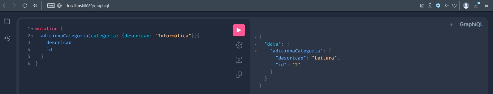
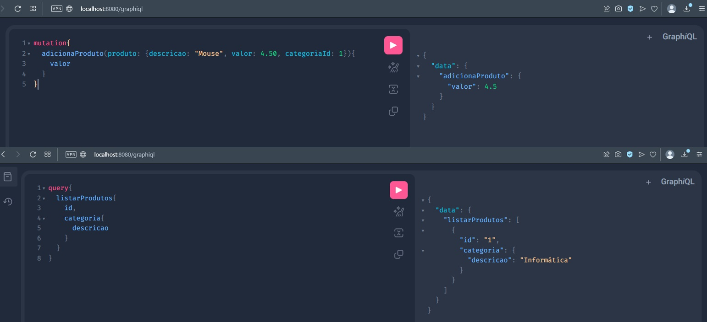

<h1> API de demonstração do GraphQL </h1>

Api desenvolvida com Spring boot

GraphQL especificação desenvolvida pelo Facebook para tornar mais performático o acesso a dados de multiplos endpoints.
 
Como vantagens tem-se o menor consumo de rede ao trafegar dados via HTTP.
Evita a criação de rotas adicionais no REST

 
Foi desenvolvido API simples para aplicar o GraphQL. O dominio é composto por Produtos N:1 Categoria sendo persistidos em banco em memória H2.
 

Mutation: 
adicionaCategoria:

 

Mutation: adicionaCategoria / Query: listarProdutos:
 
No exemplo abaixo é possivel notar que o client do recurso via query string, obtem apenas o que lhe é necessário via requisição, sem a necessidade
de se ter varios dados do objeto de retorno.

 

<h2>Tecnologias Aplicadas</h2>

Java 8

Apache Maven

Spring Boot

Spring Data JPA

Devtools

Apache Tomcat Embarcado

GraphQL

h2

